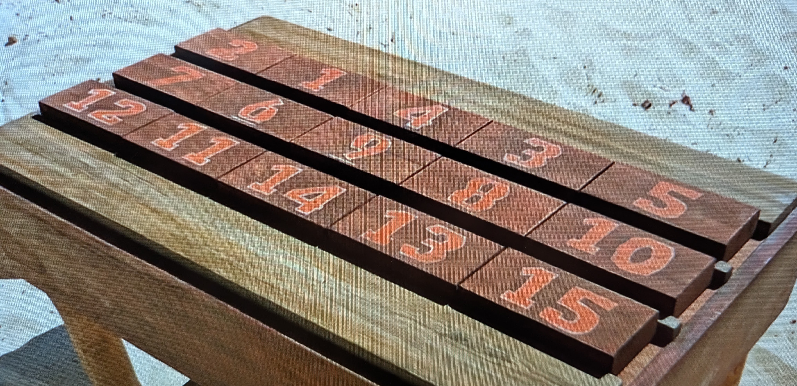

# Survivor Puzzle from Episode S48E2

Exploration of the puzzle of 15 scrambled blocks.

The initial board state as represented on the show:



The goal being to reorder them in strict numerical order.

The operations allowed them to push any row to the left, freeing up one "tile".
That tile could then be placed at the right end of any other row.

If it released a tile by doing so, they then had to put *that* tile onto some
other row.  If they placed the freed tile on a row that only had 4 tiles on it,
they would then be free to push (from the right) any other row.

## Installation

Create and activate a virtual environment:

```bash
python3 -m venv venv
source venv/bin/activate  # On Windows use `venv\Scripts\activate`
```

Install the required packages:

```bash
pip install -r requirements.txt
```

## Usage

Activate the virtual environment if not already activated:

```bash
source venv/bin/activate  # On Windows use `venv\Scripts\activate`
```

Run the program:

```bash
python main.py
```
